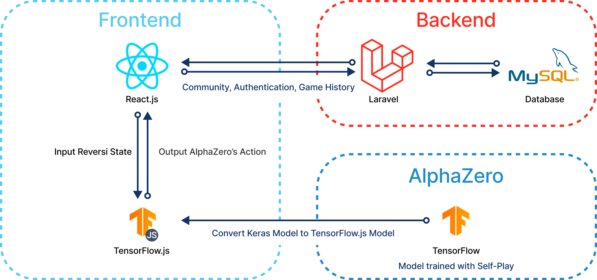
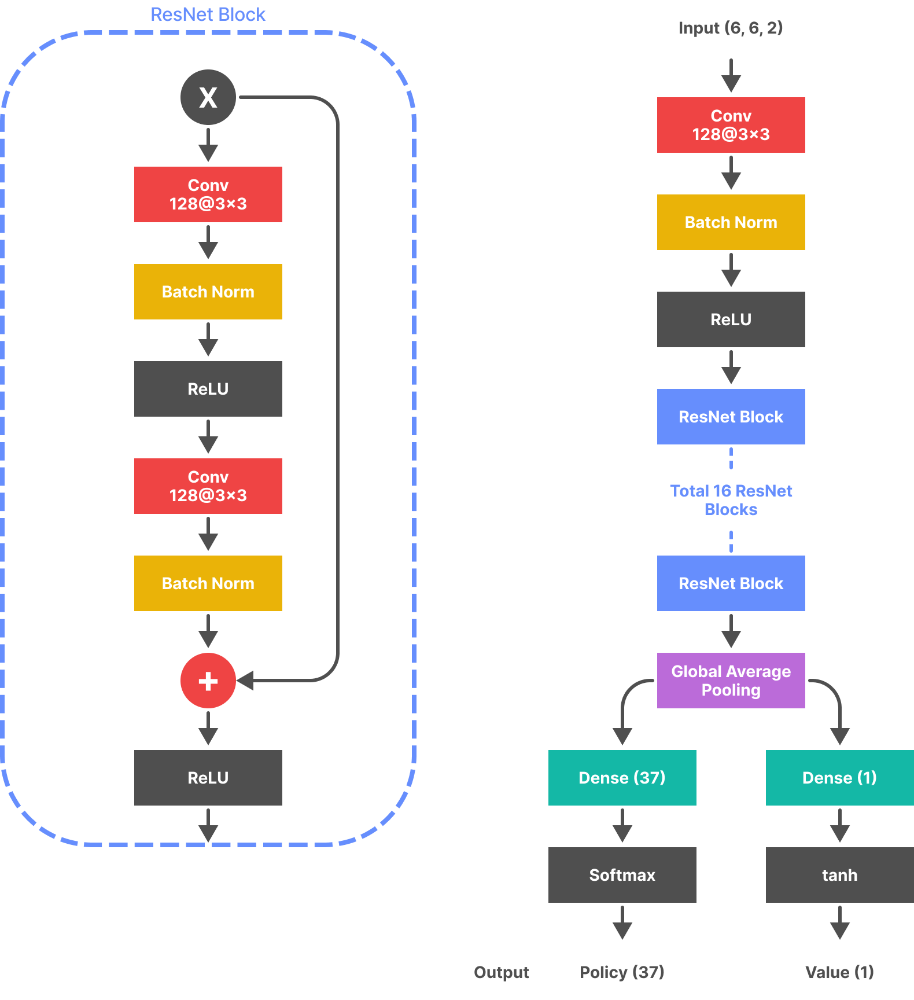

# Re:zero

</img>

Re:zero is a web application that can play Reversi against AI based on the AlphaZero (AZ) algorithm.

> Note: Re:zero is a work in progress. In the future, Re:zero will be able to play against other players.

## Features

- Play against AZ
- You can also write posts and comments on the community

## System Architecture

</img>

## Neural Network Architecture

</img>

## Folder Structure

```bash
.
├── alphazero                   # AlphaZero
│   ├── app.py                  # Flask application (no longer used)
│   ├── dual_network.py         # Dual network that outputs the policy and value using ResNet
│   ├── evaluate_best_player.py # Evaluate the best player
│   ├── evaluate_network.py     # Evaluate the network
│   ├── game.py                 # Reversi game logic
│   ├── human_play.py           # Human play
│   ├── pv_mcts.py              # PV MCTS algorithm
│   ├── self_play.py            # Self play
│   ├── train_cycle.py          # Train cycle
│   ├── train_network.py        # Train network
│   └── model                   # Trained best model
│       └── best.h5
│
├── server                      # Laravel server
│   └── ...
├── webapp                      # Next.js web application
│   ├── public                  # Static files
│   │   └── assets              # Next.js assets
│   ├── components          # Next.js components
│   ├── lib
│   │   ├── api             # Ajax calls to the server
│   │   ├── othello         # Reversi game logic for the webapp
│   │   └── ...
│   ├── pages               # Next.js pages
│   ├── store               # Zustand store (Does not used yet)
│   ├── hooks               # Next.js hooks
│   ├── typings             # type definitions
│   └── ...
└── README.md
```

## Built With

### Frontend

- [TypeScript](https://www.typescriptlang.org)
- [Next.js](https://nextjs.org/)
- [axios](https://axios-http.com/)
- [zustand](https://github.com/pmndrs/zustand)
- [SWR](https://swr.vercel.app)
- [Mantine](https://mantine.dev/)
- [Tailwind CSS](https://tailwindcss.com)
- [TensorFlow.js](https://www.tensorflow.org/js)

### Backend

- [PHP](https://www.php.net)
- [Laravel](https://laravel.com)
- [Google OAuth 2.0](https://developers.google.com/identity/protocols/OAuth2)

### AlphaZero

- [Python](https://www.python.org)
- [TensorFlow](https://www.tensorflow.org)
- [Keras](https://keras.io)
- [NumPy](https://www.numpy.org)

## Getting Started

This is an example of how you may give instructions on setting up Re:zero locally. To get a local copy up and running follow these simple example steps.

### Prerequisites

- [Node.js](https://nodejs.org) (version >= 14.x)
- [PHP](https://www.php.net) (version >= 8.1)
- [Python](https://www.python.org) (version >= 3.9)
- [Yarn](https://yarnpkg.com) (version >= 1.22) (recommended)

### Installation

1. Clone the repository

```bash
git clone https://github.com/1ncursio/laravel-othello.git
```

2. Install NPM dependencies for the frontend

```bash
cd laravel-othello/webapp
yarn
```

3. Run the frontend server

```bash
yarn dev
```

4. Install Composer dependencies for the backend

```bash
cd laravel-othello/server
composer require
```

5. Migrate the database

```bash
php artisan migrate
```

6. Copy `.env.example` to `.env` and fill in the required values

```bash
cp .env.example .env
```

7. Run the backend server

```bash
php artisan serve
```

Then open your browser and navigate to http://localhost:3000/

## Future Plans

- [ ] Refactor the code to use the Zustand
- [ ] Write tests
- [ ] Deploy the project
- [ ] Implement multi-player mode
- [ ] Migrate Backend Framework (e.g. Nest.js, fastify, django, etc.)
- [ ] Support i18n
- [ ] Support PWA
- [ ] Implement Scalable Game Board (e.g. 6x6, 8x8, 10x10, etc.)

## License

Distributed under the MIT License. See LICENSE for more information.

## Contact

[](https://www.linkedin.com/in/yechan-kim-710186230/)
[](mailto:ckswn1323@g.yju.ac.kr)
