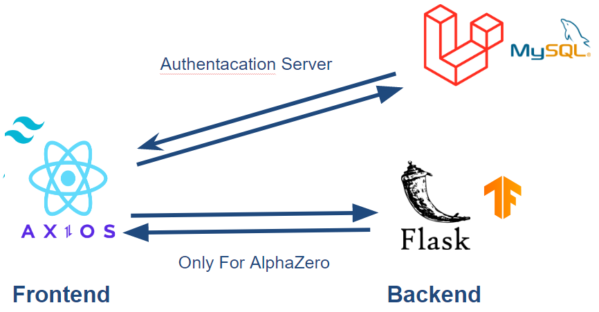

# Lathello

Lathello is a web application that can play Reversi against AI based on the AlphaZero (AZ) algorithm.

## Features

- Play against AZ
- You can also write posts

## Architecture

</img>

## Folder Structure

```bash
.
├── ai_server               # A Flask server that runs the AZ algorithm. No longer used.
│   ├── app.py              # Flask application
│   ├── dual_network.py     # Dual network that outputs the policy and value using ResNet
│   ├── game.py             # Reversi game logic
│   ├── pv_mcts.py          # PV MCTS algorithm
│   └── model               # Trained best model
│       └── best.h5
│
├── server                  # Laravel server
│   └── ...
├── webapp                  # React web application
│   ├── public              # Static files
│   └── src
│       ├── components      # React components
│       ├── lib
│       │   ├── api         # Ajax calls to the server
│       │   ├── othello     # Reversi game logic for the webapp
│       │   └── ...
│       ├── pages           # React pages
│       ├── store           # Zustand store (Does not used yet)
│       ├── assets          # React assets
│       ├── hooks           # React hooks
│       ├── typings         # type definitions
│       └── ...
└── README.md
```

## Project Stack

### Client

- React
- React Router
- TypeScript
- SWR
- Tailwind CSS
- Emotion

### Server (Laravel)

- PHP
- Laravel
- Google OAuth 2.0

### ~~Server (for AZ)~~ Deprecated

> Since the AZ is now running on the client using the TensorFlow.js, The server is no longer needed. but it is still used for the training.

- Python
- TensorFlow
- Keras
- NumPy
- Flask
